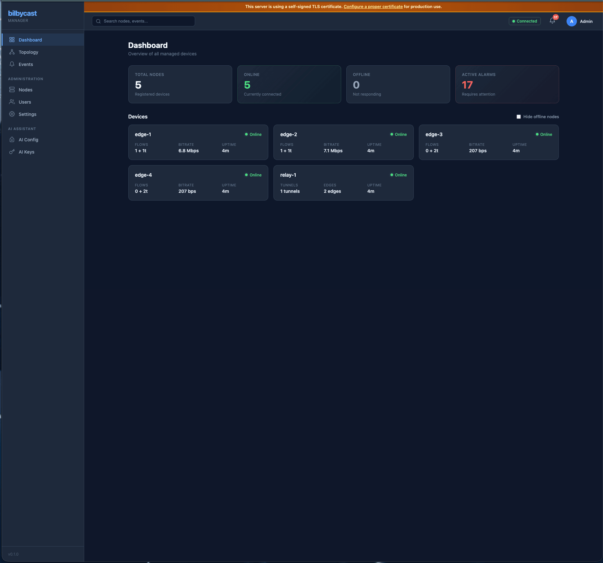
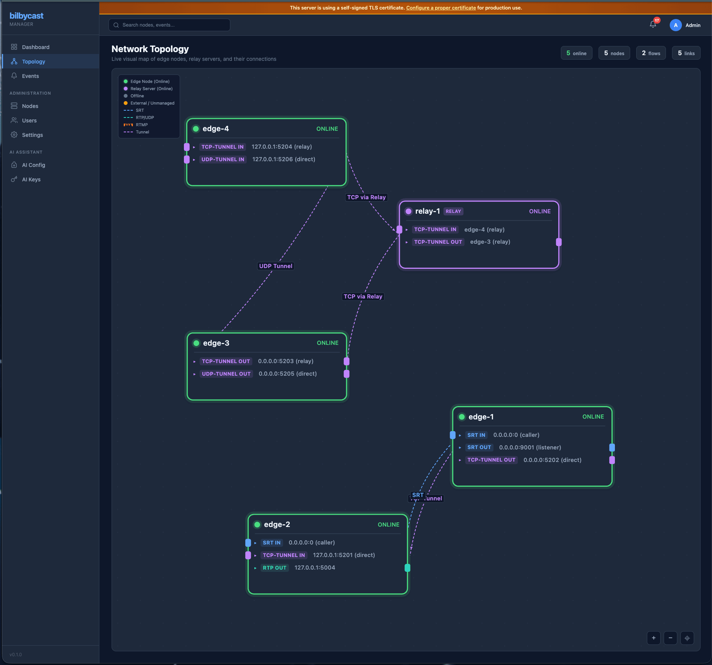
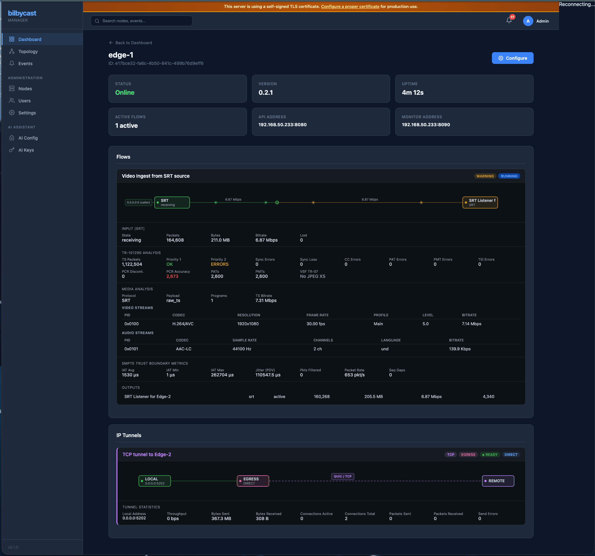

# bilbycast-manager

Centralized monitoring and management server for bilbycast-edge nodes. Provides a web dashboard, REST API, and WebSocket connectivity for real-time status, configuration, and control of distributed media transport nodes.

## Screenshots

<table>
  <tr>
    <td align="center"><b>Dashboard</b></td>
    <td align="center"><b>Network Topology (Graph / Flow views)</b></td>
  </tr>
  <tr>
    <td></td>
    <td></td>
  </tr>
  <tr>
    <td colspan="2" align="center"><b>Node Detail</b></td>
  </tr>
  <tr>
    <td colspan="2" align="center"></td>
  </tr>
</table>

## Quick Start

1. **Prerequisites**: Install the [Rust toolchain](https://rustup.rs/) (stable) and ensure SQLite3 is available on your system.

2. **Clone and build**:
   ```bash
   git clone <repo-url>
   cd bilbycast-manager
   cargo build --release
   ```

3. **Create `.env` file** from the example and generate secrets:
   ```bash
   cp .env.example .env
   # Generate two separate secrets:
   echo "BILBYCAST_JWT_SECRET=$(openssl rand -hex 32)" >> .env
   echo "BILBYCAST_MASTER_KEY=$(openssl rand -hex 32)" >> .env
   chmod 600 .env
   ```

4. **Edit `config/default.toml`** if you need to change the listen port (default: 8443) or database path.

5. **Run initial setup** to create the database and first super_admin user:
   ```bash
   ./target/release/bilbycast-manager setup --config config/default.toml
   ```

6. **Start the server**:
   ```bash
   ./target/release/bilbycast-manager serve --config config/default.toml
   ```

7. **Configure TLS** — choose one of two modes:

   **Direct mode** (default) — manager handles TLS itself:
   ```bash
   # Generate a self-signed certificate for dev/testing:
   openssl req -x509 -newkey rsa:4096 -keyout certs/server.key -out certs/server.crt \
     -days 365 -nodes -subj '/CN=localhost'
   echo "BILBYCAST_TLS_CERT=certs/server.crt" >> .env
   echo "BILBYCAST_TLS_KEY=certs/server.key" >> .env
   ```
   For production, use certificates from a trusted CA.

   **Behind proxy mode** — a load balancer terminates TLS:
   ```bash
   echo "BILBYCAST_TLS_MODE=behind_proxy" >> .env
   ```
   No certificate needed. The manager listens on plain HTTP. Only use when the LB→manager connection is on a trusted network.

8. **Open browser** at `https://localhost:8443` (direct mode) or `http://localhost:8443` (behind proxy) and log in with the admin credentials created during setup.

9. **Register edge nodes**: Navigate to the Dashboard, create a new node entry via the API, and use the generated registration token to connect edge nodes. Edge and relay nodes must use `wss://` URLs to connect.

## CLI Reference

| Command          | Description                                    |
|------------------|------------------------------------------------|
| `setup`          | Create database and first super_admin user     |
| `serve`          | Start the manager server                       |
| `reset-password` | Reset a user's password (`--username <name>`)  |
| `export`         | Export all data to JSON (`--output <file>`)     |
| `import`         | Import data from JSON (`--input <file>`)       |

All commands accept `--config <path>` (default: `config/default.toml`). The `serve` command also accepts `--port <port>` to override the listen port.

## Documentation

- [Security](docs/SECURITY.md) -- encryption, authentication, and deployment guidance
- [API Reference](docs/API.md) -- REST and WebSocket endpoints

## License

See [LICENSE](LICENSE).
